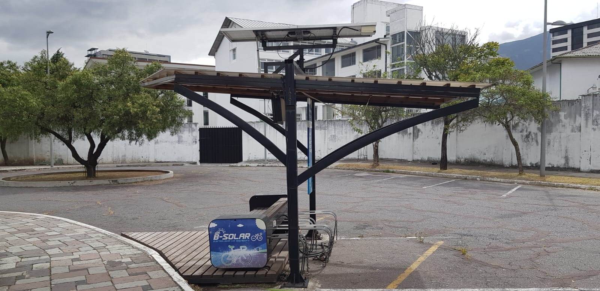
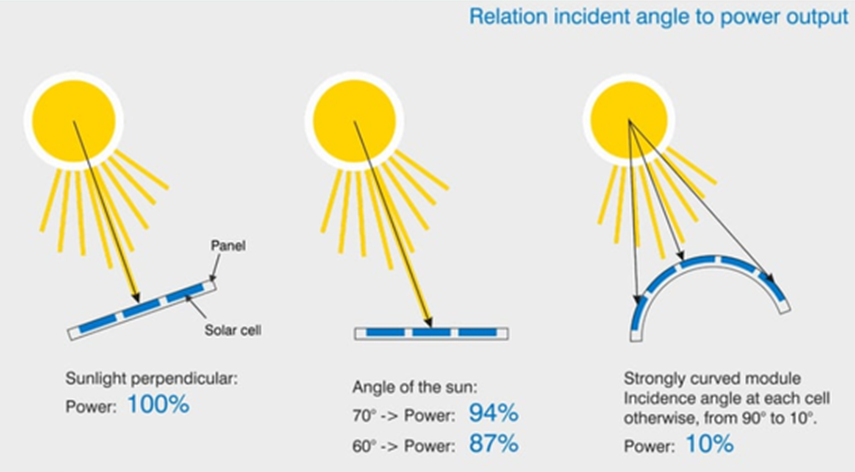
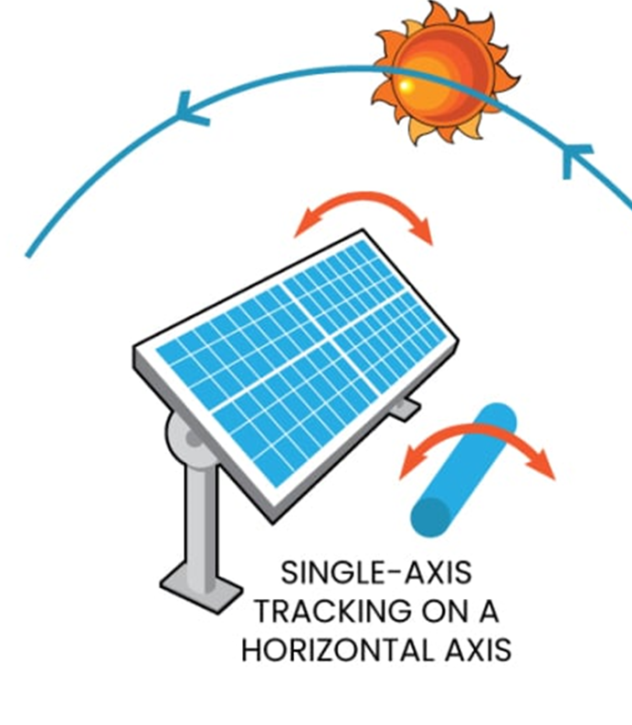
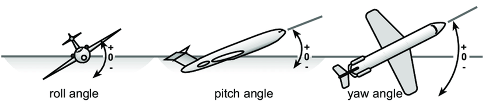
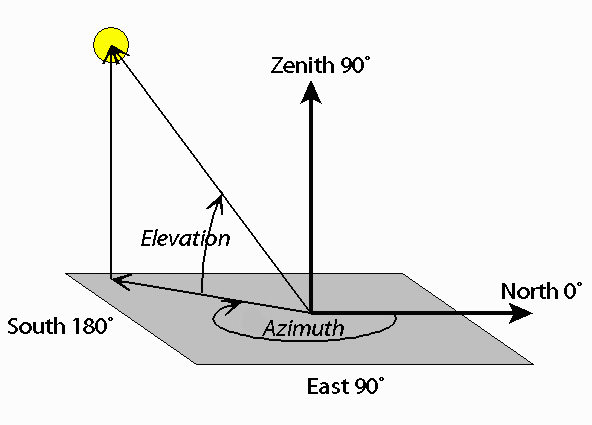

## Codigo proporcionado por el Profesor
Con el siguiente snippet de código puede obtener la posición del sol en un lugar (Campus EPN, por defecto) y fecha determinada (fecha y hora actual, por defecto).

```python
from pysolar.solar import get_altitude, get_azimuth
from datetime import datetime
from pytz import timezone


def getSolarPosition(
    latitude: float = -0.2105367,
    longitude: float = -78.491614,
    date: datetime = datetime.now(tz=timezone("America/Guayaquil")),
):
    """Calcula el ``azimuth`` y la ``elevation`` para una posición geográfica (por defecto la EPN) y la fecha ``date``.

    ## Parameters

    ## Return
    ``azimuth``: ángulo en grados desde el norte hasta la projección en la tierra [0 -> 360).
    ``elevation``: ángulo del sol hacia la proyección en la tierra [-90 -> 90].

    """

    az = get_azimuth(latitude, longitude, date)
    el = get_altitude(latitude, longitude, date)

    return az, el


getSolarPosition()
```
# Proyecto-Final-Panel-Solar

# Descripción
La facultad de Ingeniería Mecánica dispone de varios sistemas de seguimiento solar, uno de ellos se muestra en la siguiente fotografía:



Para este proyecto, se debe realizar el cálculo de los ángulos de control para un seguidor solar de 2 grados de libertad. 

# Seguidor solar
Un seguidor solar es un sistema de orientación para maximizar la exposición a la luz solar. Esto se consigue cuando el panel se orienta perpendicularmente a la luz solar incidente. Cuando el panel no se encuentra perpendicular, la cantidad de energía generada disminuye significativamente.



Los ángulos de control en el seguidor solar de 2 grados de libertad son:

1. $roll$: ángulo de giro alrededor del eje que mira al norte.



2. $pitch$: ángulo de giro alrededor del eje que mira al este.

[**IMPORTANTE**] A diferencia de otro tipo de seguidores solares, la EPN tiene un seguidor solar alrededor del ángulo $pitch$, en lugar del ángulo $yaw$. 


# Posición solar
La posición del sol se mide con respecto a dos ángulos: 
* $\theta$ que es el ángulo de **elevación** del sol con respecto a su proyección en la superficie,
* $\alpha$ que es el ángulo **azimutal** de la proyección del sol en la superficie con respecto al norte.



# Instalación de Dependencias para el Simulador de Seguidor Solar

Este proyecto requiere varias bibliotecas de Python para calcular la posición del sol, determinar los ángulos de orientación de un panel solar y visualizar los resultados en una interfaz gráfica.

## Prerrequisitos

- Tener Python 3.8 o superior instalado. Puedes verificar tu versión de Python ejecutando:
  ```sh
  python --version
  ```
- Tener `pip` actualizado:
  ```sh
  python -m pip install --upgrade pip
  ```

## Instalación de Librerías

Ejecuta el siguiente comando en una celda de Jupyter Notebook para instalar todas las dependencias necesarias:

```python
!pip install matplotlib numpy tkinter pytz pysolar astral
```

### Explicación de las dependencias

- `matplotlib`: Para generar gráficos en 3D.
- `numpy`: Para cálculos matemáticos y manipulación de matrices.
- `tkinter`: Para la interfaz gráfica interactiva (incluido en Python por defecto).
- `pytz`: Para manejar zonas horarias correctamente.
- `pysolar`: Para calcular la posición del sol en función de coordenadas geográficas y tiempo.
- `astral`: Para obtener información sobre el amanecer y atardecer.

